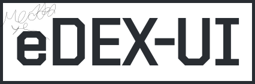

   
  
  
	 

eDEX-UI is a fullscreen, cross-platform terminal emulator and system monitor that looks and feels like a sci-fi computer interface.

### NOTICE: This REPO is NOT finished and might not come with new updates
---
Chapters: Installation, Features, Q&A, Credits, Nerds only
---
## Installation
1. download the eDEX-UI software depending on your operating system
2. replace all folders in the already installed eDEX-UI software that has the same name as the folder in this repository.

---

## Features
- Fully featured terminal emulator with tabs, colors, mouse events, and support for `curses` and `curses`-like applications.
- Real-time system (CPU, RAM, swap, processes) and network (GeoIP, active connections, transfer rates) monitoring.
- Full support for touch-enabled displays, including an on-screen keyboard.
- Directory viewer that follows the CWD (current working directory) of the terminal.
- Advanced customization using themes, on-screen keyboard layouts, CSS injections. See the [wiki](https://github.com/GitSquared/edex-ui/wiki) for more info.
- Optional sound effects made by a talented sound designer for maximum hollywood hacking vibe.

## Nerds only
#### Starting from source:
##### MacOS
You will need Xcode command line tools.

## I have a problem!
Go to the issues tab to see if yours has already been reported. You are allowed to report any problems with the software :D If a problem report has been closed, or deleted it means that it will most likely be fixed in the next version.

# CREDITS
[GitSquared](https://github.com/GitSquared)
The original eDEX-UI software provided by [GitSquared](https://github.com/GitSquared).

### NOTICE: As previously said, this REPO is NOT finished and may come with new updates
